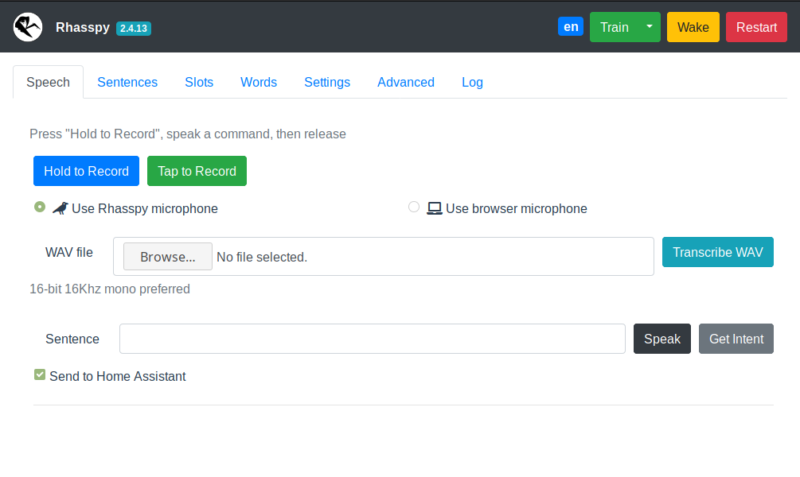
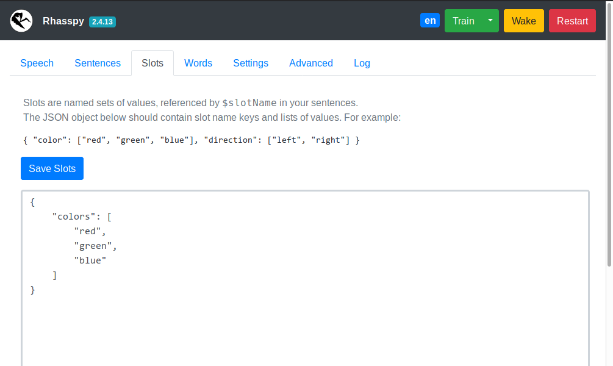
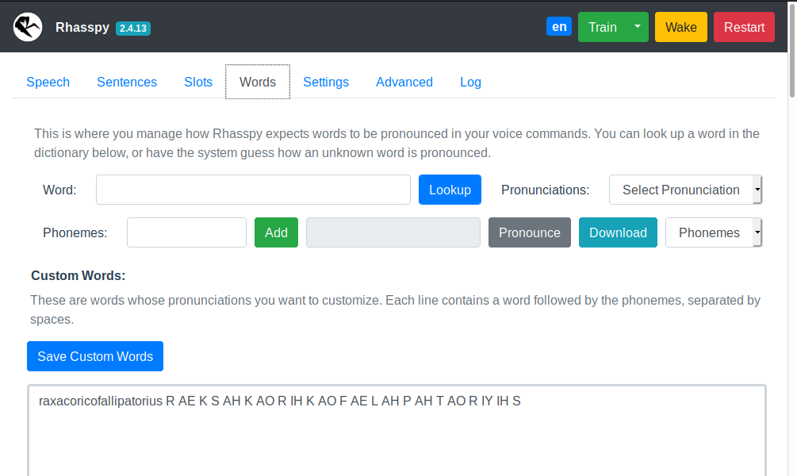
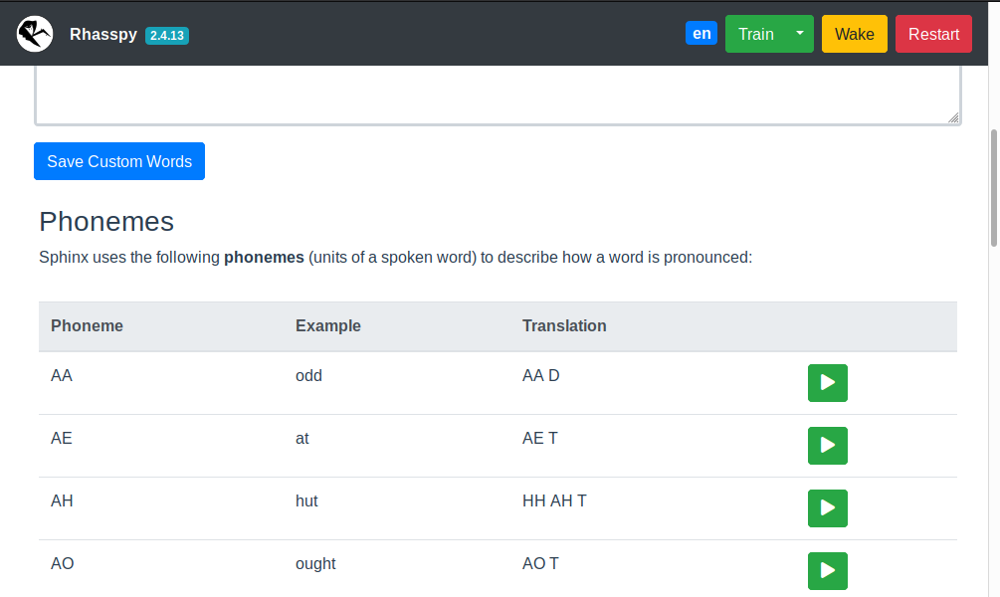
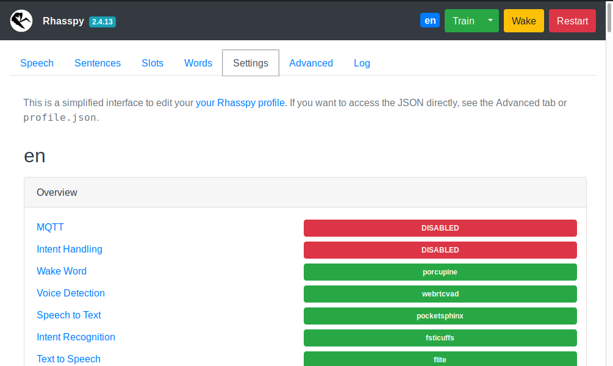
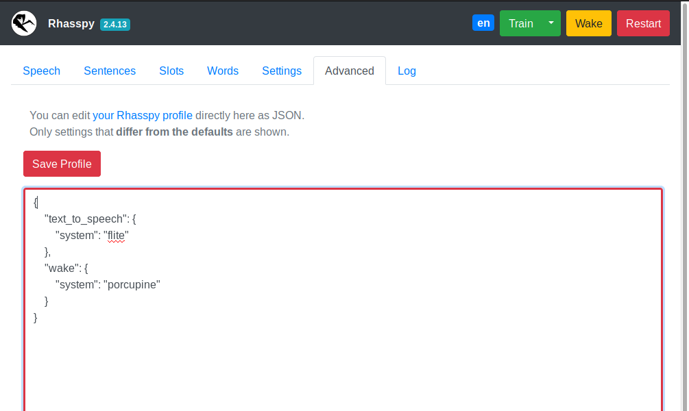
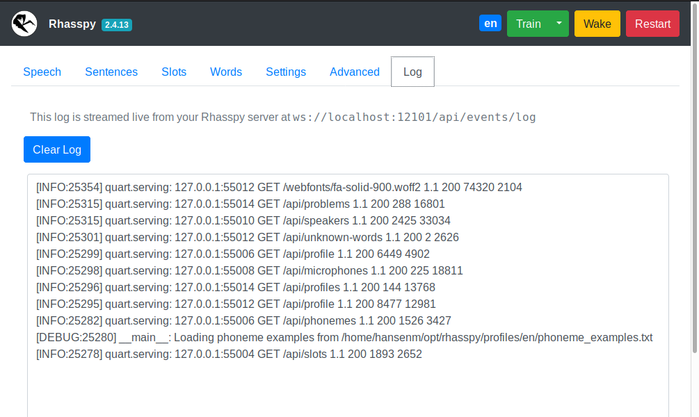

# Usage

You can interact with Rhasspy in more ways than your voice:

* [Web Interface](#web-interface)
* [Home Assistant](#home-assistant)
* [Node-RED with Websockets](#node-red)
* [MQTT and Snips](#mqtt-and-snips)
* [HTTP API](#http-api)
* [Command Line](#command-line)

## Web Interface

A browser-based interface for Rhasspy is available on port 12101 by default ([http://localhost:12101](http://localhost:12101) if running locally). From this interface, you can test voice commands, add new voice commands, re-train, and edit your profile.

### Top Bar

The top bar of the web interface lets you perform some global actions on Rhasspy, regardless of which tab you have selected.


* Click the Rhasspy logo to reload the page
* Click the version number to test the [HTTP API](#http-api)
* The green `Train` button will re-train your profile
    * Use the `Clear Cache` drop down to train from scratch
* The yellow `Wake` button will wake Rhasspy up and start listening for a voice command
* The red `Restart` button forces Rhasspy to restart

### Speech Tab

Test voice and text commands.



* Record a voice command with `Hold to Record` or `Tap to Record`
* Upload a WAV file with a voice command
* Enter a text command and either execute it (`Get Intent`) or `Speak` the sentence
* Uncheck `Send to Home Assistant` if you **don't** want Rhasspy to send events to Home Assistant

### Sentences Tab

Add new voice commands to Rhasspy using the [template syntax](training.md#sentencesini).


* Edits `sentences.ini` by default
* Use the `Add File` button to create additional sentence template files
    * These should be prefixed by the `sentences_dir` in your [profile](profiles.md). For example, `intents/more-commands.ini`
* The drop down can be used to switch editing between different template files

### Slots Tab

Edit your [slots lists](training.md#slots-lists) as JSON (keys = slot names, values = lists of slot values).



* New slot values will overwrite previous ones
* Delete a slot by providing an empty list for its JSON key

### Words Tab

Teach Rhasspy how to pronounce new words.



* Look up pronunciation(s) for known words (in your profile's `base_dictionary.txt` file)
* Have Rhasspy guess how to pronounce a new (unknown) word
* Pronounce the current word or download a WAV file of it
* Add new words to your `custom_words.txt` file
* Shows words that Rhasspy doesn't know (when training fails)



Table of examples for each phoneme in your profile language.
Use this when constructing pronunciations for custom words.

### Settings Tab

Simplified interface for editing your [profile](profiles.md).
Make sure to restart Rhasspy after saving changes.



### Advanced Tab

Direct interface for editing your [profile](profiles.md).
**Be careful!** Entering invalid settings here can cause Rhasspy to not start.



### Log Tab

Streams Rhasspy's log output over a websocket.



## Home Assistant

Rhasspy communicates with Home Assistant directly over its [REST API](https://developers.home-assistant.io/docs/en/external_api_rest.html).
Specifically, Rhasspy intents are POST-ed to the [events endpoint](https://developers.home-assistant.io/docs/en/external_api_rest.html#post-api-events-lt-event_type).

If you have a Rhasspy intent named `ChangeLightColor` with `name` and `color` slots like in the [RGB light example](index.md#rgb-light-example), then Home Assistant will receive an event of type `rhasspy_ChangeLightColor` whose event data is:

```json
{
  "name": "bedroom",
  "color": "red"
}
```

when you say "set the bedroom to red". You should write a custom [automation with an event trigger](https://www.home-assistant.io/docs/automation/trigger/#event-trigger) to do something when this event arrives. Catching the example event would look like:

```yaml
automation:
  trigger:
    platform: event
    event_type: rhasspy_ChangeLightColor
    event_data:
      color: red
  action:
    ...
```

You've now added offline, private voice commands to your Home Assistant. Happy automating!

### Getting the Spoken Text

The Home Assistant event will contain two extra slots besides the ones you specify:

* `_text` - spoken voice command text with [substitutions](training.md#substitutions)
* `_raw_text` - literal transcription of voice command

## Node-RED

Rhasspy can interact directly with [Node-RED](https://nodered.org) directly through [websockets](usage.md#websocket-events).
Simply add a websocket input and set the path to `ws://<rhasspy>:12101/api/events/intent` where `<rhasspy>` is the hostname or IP address of your Rhasspy server.
Make sure to also set send/receive to "entire message".


More example flows are available [on Github](https://github.com/synesthesiam/rhasspy/tree/master/examples/nodered).

### WebSocket Events

Rhasspy supports multiple websocket event endpoints:

* `/api/events/intent`
    * Intent recognized or not
* `/api/events/wake`
    * Wake word detected
* `/api/events/text`
    * Speech transcription
    
#### WebSocket Intents

Whenever a voice command is recognized, Rhasspy emits JSON events over a websocket connection available at `ws://YOUR_SERVER:12101/api/events/intent` (replace `ws://` with `wss://` if you're using [secure hosting](usage.md#secure-hosting-with-https)).
You can listen to these events in a [Node-RED](https://nodered.org) flow, and easily add offline, private voice commands to your home automation set up!

For the `ChangLightState` intent from the [RGB Light Example](index.md#rgb-light-example), Rhasspy will emit a JSON event like this over the websocket:

```json
{
  "text": "set the bedroom light to red",
  "intent": {
    "name": "ChangeLightColor",
    "confidence": 1
  },
  "entities": [
    {
      "entity": "name",
      "value": "bedroom"
    },
    {
      "entity": "color",
      "value": "red"
    }
  ],
  "slots": {
    "name": "bedroom",
    "color": "red"
  }
}
```

#### WebSocket Wake

When the wake word is detected, or Rhasspy is woken up via the `/api/listen-for-command` HTTP endpoint, a JSON event is emitted at `ws://YOUR_SERVER:12101/api/events/wake` (`wss://` if using HTTPS) like:

```json
{
    "wakewordId": "default",
    "siteId": "default"
}
```

The `wakewordId` is set using the model or file name of your wakeword model (e.g., `porcupine` for `porcupine.ppn`). The `siteId` comes from your `mqtt.siteId` profile setting.

#### WebSocket Transcriptions

Each time a voice command is transcribed, Rhasspy emits a JSON event at `ws://YOUR_SERVER:12101/api/events/text` (`wss://` if using HTTPS) like:

```json
{
    "text": "text from voice command",
    "wakewordId": "default",
    "siteId": "default"
}
```

The transcription is contained in the `text` property. `wakewordId` is the id of the wakeword that initiated the voice command (or `default`). The `siteId` comes from your `mqtt.siteId` profile setting.

## MQTT and Snips

Rhasspy is able to interoperate with Snips.AI services using the [Hermes protocol](https://docs.snips.ai/reference/hermes) over [MQTT](http://mqtt.org). The following components are Snips/Hermes compatible:

* [Microphone input](audio-input.md#mqtthermes)
* [Wake word](wake-word.md#mqtthermes)
* [Speech to text](speech-to-text.md#mqtthermes)
* [Intent recognition](intent-recognition.md#mqtthermes)
* [Audio output](audio-output.md#mqtthermes)

## HTTP API

Rhasspy features a comprehensive HTTP API available at `/api/`, documented with [OpenAPI 3](https://github.com/OAI/OpenAPI-Specification) (Swagger). See the [HTTP API reference](reference.md#http-api) for more details.

### Secure Hosting with HTTPS

If you need to access Rhasspy's web interface/API through HTTPS (formally SSL), you can provide a certificate and key file via command-line parameters or the Hass.io configuration.

If you're running Rhasspy via Docker or in a virtual environment, add `--ssl <CERT_FILE> <KEY_FILE>` to the command-line arguments where `<CERT_FILE>` is your SSL certificate and `<KEY_FILE>` is your SSL key file.

You can generate a self-signed certificate with the following command:

    openssl req -x509 -newkey rsa:4096 -nodes -out cert.pem -keyout key.pem -days 365

After answering the series of questions, you should have `cert.pem` and `key.pem` in your current directory. Then run Rhasspy with:

    <RHASSPY COMMAND> --ssl cert.pem key.pem

The web interface will now be available at [https://localhost:12101](https://localhost:12101) and the web socket events at `wss://localhost:12101/api/events/intent`

In Hass.io, you will need to set the following options via the web interface or in your JSON configuration:

* `ssl`: `true`
* `certfile`: `cert.pem`
* `keyfile`: `key.pem`

## Command Line

You can access portions of Rhasspy's functionality without running a web server through the command-line interface.
The `rhasspy` Python module runs this interface in its `__main__`, so it's accessible from Rhasspy's source code directory by running:

    python3 -m rhasspy <COMMAND> <ARGUMENTS>

This will only work inside a properly set up [virtual environment](installation.md#virtual-environment), however.
If you run Rhasspy through [Docker](installation.md#docker), the [rhasspy-cli](https://github.com/synesthesiam/rhasspy/blob/master/bin/rhasspy-cli) script should be used instead:

    wget https://github.com/synesthesiam/rhasspy/blob/master/bin/rhasspy-cli
    chmod +x rhasspy-cli
    ./rhasspy-cli --help

Put this script in your `~/bin` directory so that you can refer to it as `rhasspy-cli` from any directory.
By default, it will look for profiles in `$XDG_CONFIG_FILE/rhasspy/profiles`, which is probably `~/.config/rhasspy/profiles` (see [XDG specification](https://specifications.freedesktop.org/basedir-spec/basedir-spec-latest.html) for more information).

**Beware**: the `rhasspy-cli` script runs under your user account and grants Rhasspy **write access to your home directory**.
This is needed to save files during the training process, and to avoid those files being owned by `root`.
The [rhasspy-cli-ro](https://github.com/synesthesiam/rhasspy/blob/master/bin/rhasspy-cli-ro) script can be used for read only operations, such as speech to text or intent handling, but cannot make any changes to your file system.

### Top-Level Arguments

The `rhasspy-cli` script takes a command and a set of arguments:

    rhasspy-cli --profile <PROFILE_NAME> <COMMAND> <ARGUMENTS>

Adding `--debug` before the command will print additional information to the console:

    rhasspy-cli --debug --profile <PROFILE_NAME> <COMMAND> <ARGUMENTS>

You can override profile settings with `--set` like this:

    rhasspy-cli --profile <PROFILE_NAME> --set <SETTING_NAME> <SETTING_VALUE> ... <COMMAND> <ARGUMENTS>

See the [command-line reference](reference.md#command-line) for available commands.
